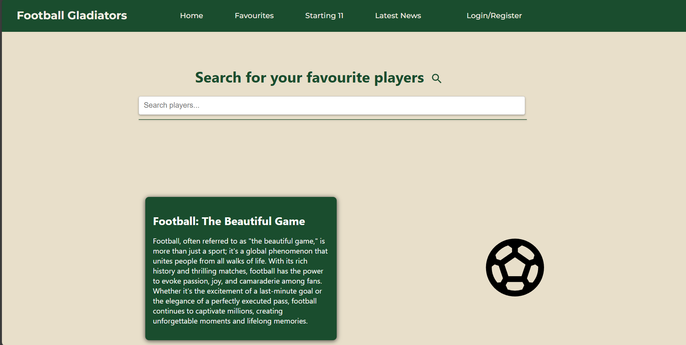
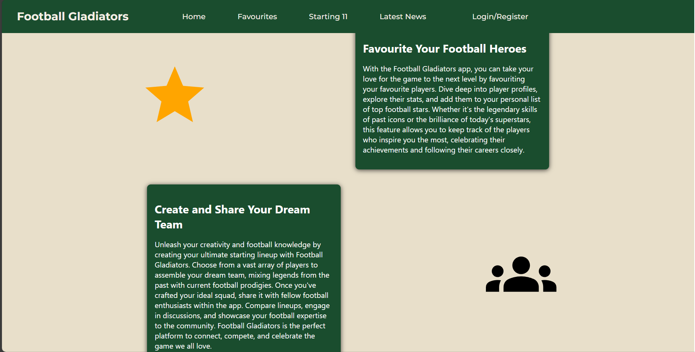
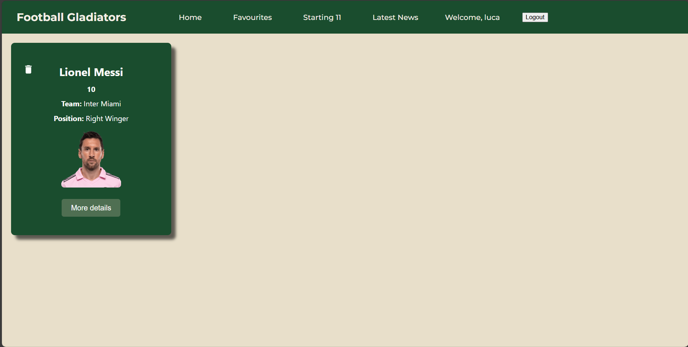
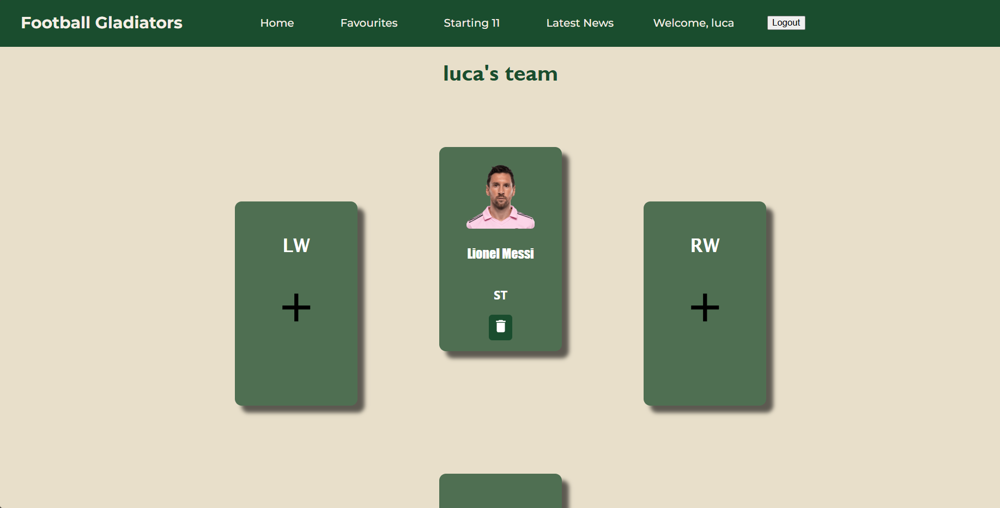
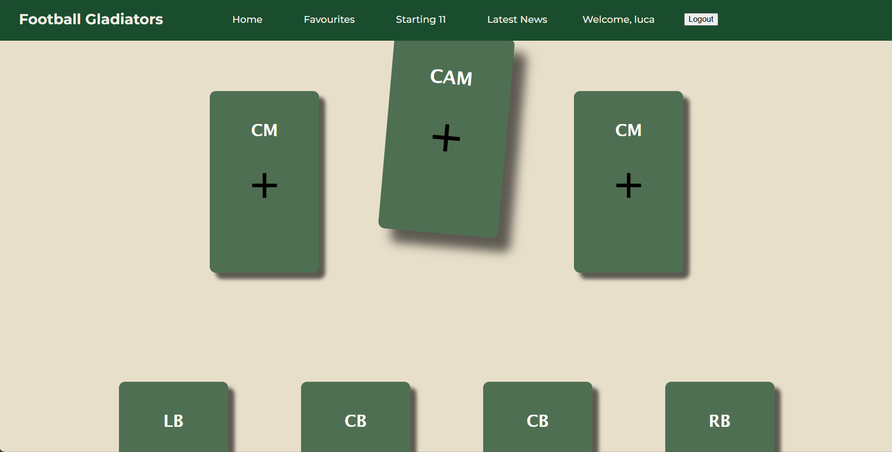
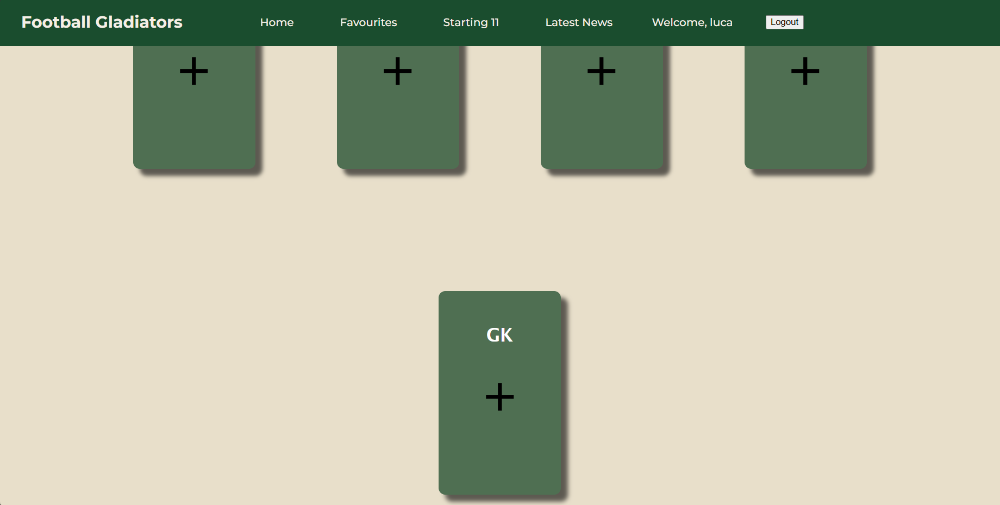
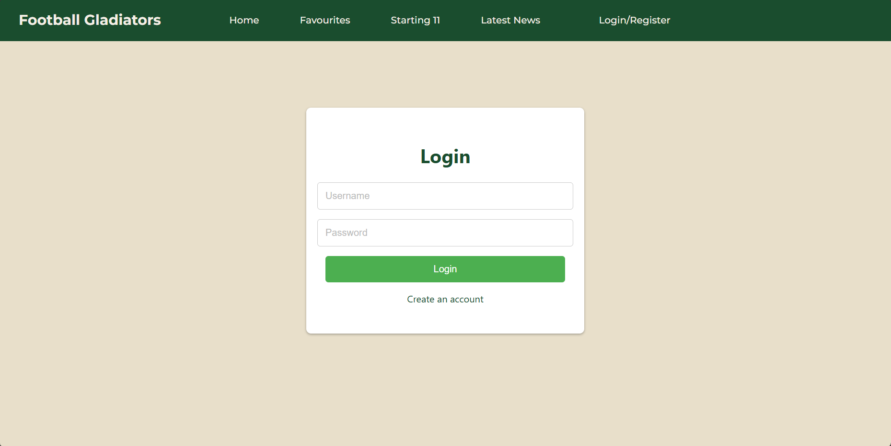
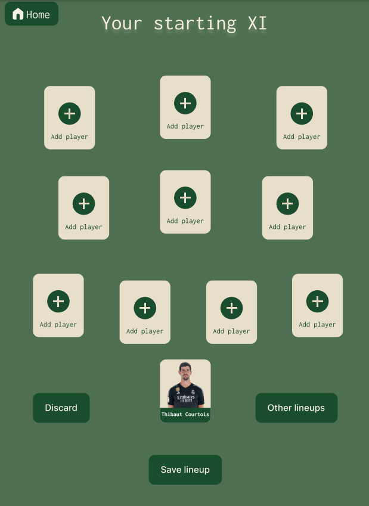
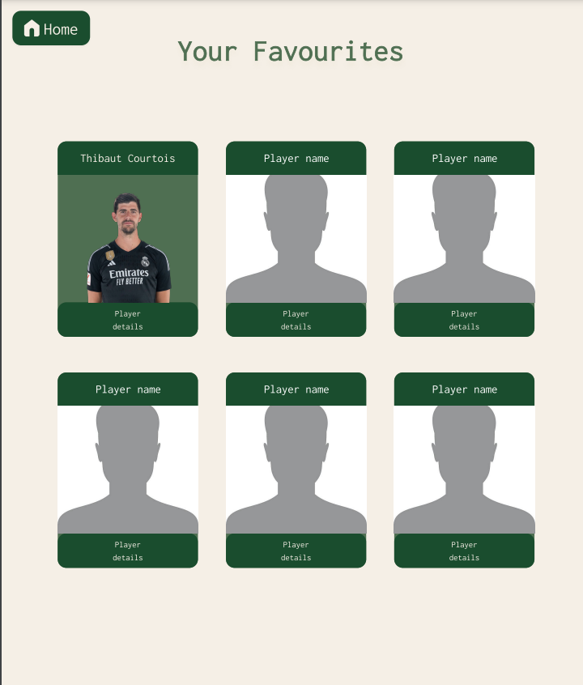

# Football Gladiators

### Pictures of the actual frontend

Home page:

Favorites page:

Starting Eleven Page:

News page:

Login page:

## Brief description of the project
Football Gladiators is a web-app designed to facilitate the communication between die-hard football fans. Passionates of the sport can easily create their best starting eleven of all time using our search tool and our database, and so are able to show their friends who they think were the best 11 footballers of all time.
## Frontend mockup

Home page:

Login and register:

Starting Eleven page:

Favorites page:

## Team members
Iani Meghea, Luca Eftimie, Alex Stroescu, Vlad Obreja
## Installation details
Prerequisites

* Python 3.x
* Node.js and npm (Node Package Manager)
* Git
Setup Instructions
	

Create a virtual envirnoment

	- in your terminal/command prompt, create a virtual environment
		~python -m venv <your-environment-name>
	-activate the envronment
		- on MacOS: ~<your-environment-name>/bin/activate
		- on Windows:  ~<your-environment-name>\Scripts\activate

Clone the repository:	

~git clone https://github.com/VU-Applied-Programming-for-AI-2024/Group-6-.git
~cd Group-6-

Install the required dependencies:	
    
~ pip install -r requirements.txt	(for backend dependencies)

Navigate to frontend and install requirements for frontend	

~cd frontend\frontend	
~npm install

Open project in VScode, or preferred IDE	

~code .

Open 2 terminals in VScode from top navbar. In the first one, navigate to backend and start the server:	

~cd Group-6-\backend	
~python app.py

In the second one, navigate to frontend and start the React server:	

~cd Group-6-\frontend\frontend	
~npm start

With these instructions, the React server will start on localhost:3000 and the backend app.py in Flask will run on port 5000

## Architecture
    Group-6-/
├── backend/
│   ├── app.py
│   ├── setup.py
│   ├── database.db
│   ├── .gitignore
├── frontend/
	├── frontend/
│   		├── public/
│   		├── src/
│   		├── package.json
│   		├── .gitignore
 ├── requirements.txt
